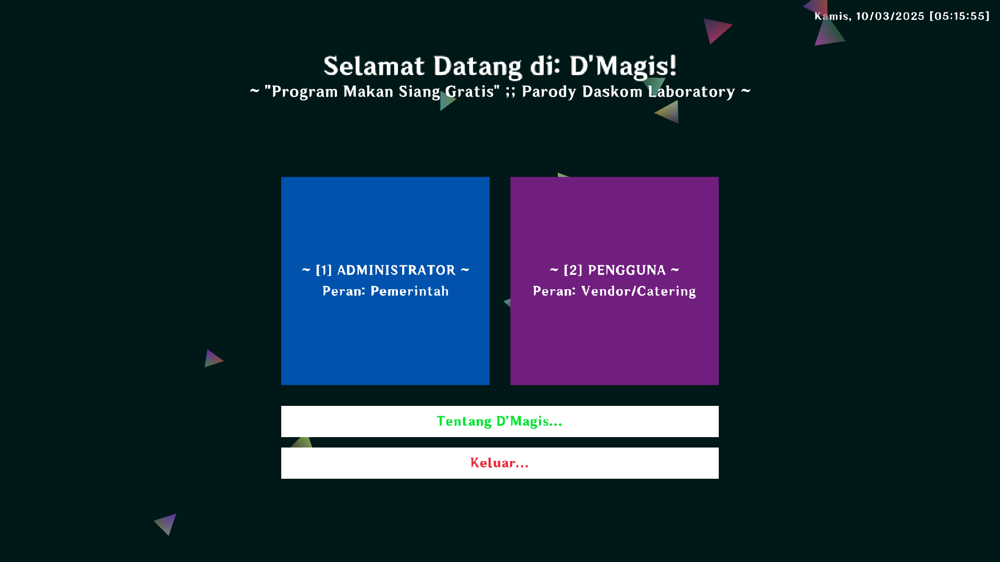
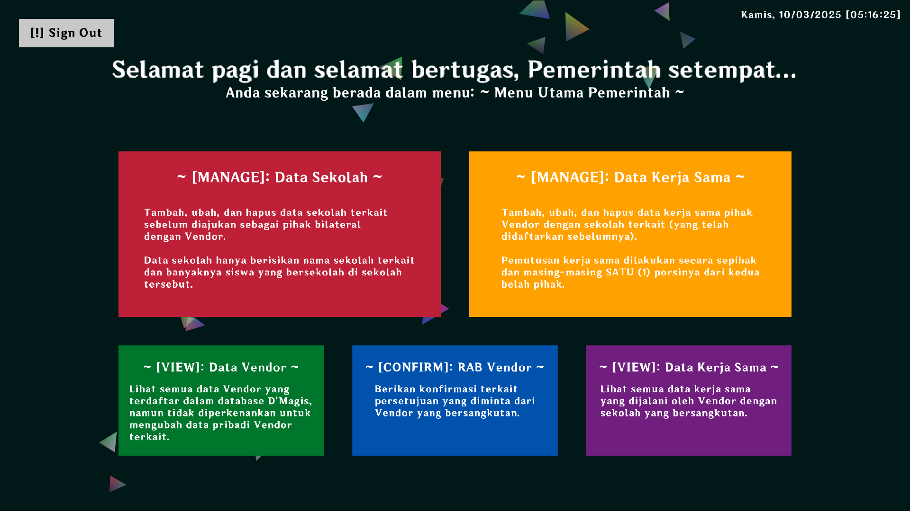
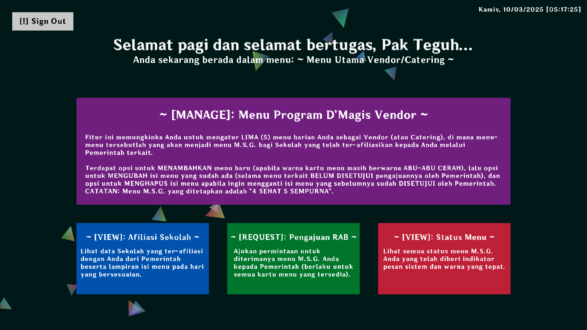
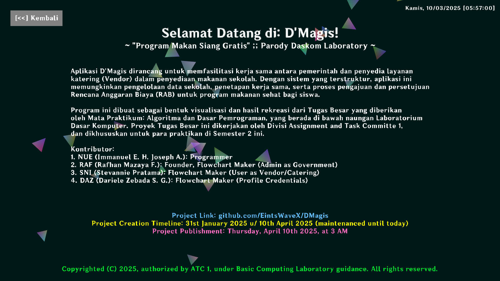

# D'Magis: Free Lunch Program PARODY

---

## NOTE: Please READ this first before you're going to open the link down below!

[D'Magis: Free Lunch Program PARODY, by Team ATC 1 and Telkom University's Basic Computing Laboratory](https://eintswavex.github.io/DMagis)
[D'Magis: Free Lunch Program PARODY, by Team ATC 1 and Telkom University's Basic Computing Laboratory](https://eintswavex.github.io/DMagis)
[D'Magis: Free Lunch Program PARODY, by Team ATC 1 and Telkom University's Basic Computing Laboratory](https://eintswavex.github.io/DMagis)

```text
The website application is **NOT RESIZEABLE**, thus leaving the web-app may get
zoomed way over than your native DPI screen. In order to fix this, make sure you
adjust the **ZOOM LEVEL** on your browser and make sure the shown screen look like
already got **CENTERED** properly.

Before you're going to experience the whole program, make sure to:
1. Decrease the zoom level of your browser until things look "centered."
2. Un-check the check-box "Lock/hide mouse pointer" on the Emscripten header.
3. For better experience, click the "Fullscreen" button.
```

[D'Magis: Free Lunch Program PARODY, by Team ATC 1 and Telkom University's Basic Computing Laboratory](https://eintswavex.github.io/DMagis)
[D'Magis: Free Lunch Program PARODY, by Team ATC 1 and Telkom University's Basic Computing Laboratory](https://eintswavex.github.io/DMagis)
[D'Magis: Free Lunch Program PARODY, by Team ATC 1 and Telkom University's Basic Computing Laboratory](https://eintswavex.github.io/DMagis)

---

## Description

D'Magis Application: **(PARODY) Government Collaboration Platform and Vendor for School Food Provision**

The D'Magis application is designed to facilitate cooperation between the government and catering service providers (vendors) in providing school food. With a structured system, this application allows the management of school data, determination of cooperation, as well as the process of submitting and approval of the Budget Plan (RAB) for a healthy food program for students.

---

## D'Magis' Features and Roles

1. Administrator, as The Government.
As the party who manages this program, the admin has access to:

    - ✅ See the list of vendors available in the system.
    - ✅ Add school data along with the number of students who will receive services.
    - ✅ Establish cooperation between each school and one particular vendor.
    - ✅ See the cooperation data between schools and vendors.
    - ✅ Managing RAB Approval from related vendors, with the status:
        - Approved: F.L. Menu is accepted and can be implemented.
        - Being reviewed: F.L. Menu is in the evaluation process.
        - Rejected: F.L. Menu does not meet the requirements and must be revised.

2. User, as The Vendor (or Catering).
As a food service provider, vendors can:

    - ✅ Register and enter the system to access features.
    - ✅ See a list of registered schools and information on the D'Magis Cooperation.
    - ✅ Set the daily menu for the D'Magis program, with features:
        - Add a menu according to the vendor's choice.
        - Change the existing menu.
        - Delete menu that is not used.
    - ✅ See a list of menus that have been set, complete with the status of F.L. Menu submission:
        - Not submitted: If F.L. Menu has not been sent to the government.
        - Appear blank if there is no menu available for certain days.
    - ✅ Submit a F.L. Menu to the government to get approval before implementation.

---

## Tutorial: Build for Yourself

In this specific repository, you can only build this code for yourself only using the `main.c` code that is compiled to `index.wasm`, and it will generate all the necessary HTML/JS files accordingly.

First of all, you need to install Emscripten first, since we're going to play around with Emscripten here a lot.

### 1. Emscripten Installation and Setup

If you're on a **BASH-based operating system**, you should go ahead and copy paste all of these commands, but make sure that firstly, all you gotta do is to find your nice and sweet spot for the `emsdk` installation.

```bash
git clone https://github.com/emscripten-core/emsdk.git
cd emsdk
./emsdk install latest
./emsdk activate latest
source ./emsdk_env.sh
```

Here's another version for the command-lines but for **WINDOWS operating systems** only:

**NOTE: This part of the setup will most of the time, only works around with your Windows Command Prompt. So, never run these commands in your Windows PowerShell or inside your Visual Studio Code, unless your VS Code or the Powershell has already had a built-in environment setup from your own device!**

```bash
git clone https://github.com/emscripten-core/emsdk.git
cd emsdk
.\emsdk install latest
.\emsdk activate latest
.\emsdk_env.bat
```

### 2. D'Magis Project Cloning

After you've successfully activating the `emsdk` environment, make sure that the TERMINAL you're working and running `emsdk` with is still OPENED UP and NEVER CLOSE IT YET until you've finished building the whole application, unless you want to activate them again in some time later.

This step is just really simple, just go before the `emsdk` folder (using command `cd ..`), and then just go ahead copy-pasting these TWO (2) command lines down below:

**NOTE: These operations are both supported for Windows and UNIX/POSIX based operating systems.**

```bash
git clone https://github.com/EintsWaveX/DMagis.git
cd DMagis
```

### 3. Raylib Installation and Setup

In order to be able to build this fully up to your extend, you have to get the `raylib` library here, made by `raysan5`. This works for both **WINDOWS and UNIX/POSIX** operating systems, so you may just follow the command-lines here, step-by-step (or just copy pasted them already).

**NOTE: Make sure you already follow EVERYTHING on the SECOND STEP above, since this part of installation and setup is now taking the place inside the DMagis/ folder, so make sure you get to this folder already after cloning it.**

```bash
git clone https://github.com/raysan5/raylib.git
cd raylib
mkdir build
cd build

emcmake cmake .. -DPLATFORM=Web -DBUILD_EXAMPLES=OFF -DCMAKE_BUILD_TYPE=Release -DBUILD_SHARED_LIBS=OFF -DSTATIC=ON
emmake make
```

**ANOTHER NOTE: The build process will take WAY TOO LONG if you didn't include that `-DBUILD_EXAMPLES=OFF` specific sub-command, so here it is, a much faster building system for the Raylib setup.**

### 4. Compiling the C code into WASM code (and web-utils) files

After you've done everything here based on the building statements above, now we're' going back to work with `emsdk` again, so get your `emsdk` TERMINAL back to work again.

This last step will be crucial, and for me myself, this is one of the hardest part building the web-application here. But for you, I'll just put in the command-lines here and you can just simply execute them. The command-lines here are divided into TWO (2) categories, ONE for **Windows operating systems**, and the other ONE for **UNIX/POSIX operating systems**.

1. **Build for Windows:**

```bash
emcc main.c ^
  raylib\build\raylib\libraylib.a ^
  -o index.html ^
  -Iraylib\src ^
  -DPLATFORM_WEB ^
  -s USE_GLFW=3 ^
  -s ASYNCIFY ^
  -s FORCE_FILESYSTEM=1 ^
  -s EXPORTED_FUNCTIONS="['_main']" ^
  -s EXPORTED_RUNTIME_METHODS="['ccall','cwrap','FS']" ^
  -s STACK_SIZE=16MB ^
  -s TOTAL_MEMORY=256MB ^
  -s ASSERTIONS=2 ^
  -s SAFE_HEAP=1 ^
  -s ENVIRONMENT=web ^
  -lidbfs.js ^
  --preload-file assets ^
  -O1
```

2. **Build for UNIX/POSIX:**

```bash
emcc main.c \
  raylib\build\raylib\libraylib.a \
  -o index.html \
  -Iraylib\src \
  -DPLATFORM_WEB \
  -s USE_GLFW=3 \
  -s ASYNCIFY \
  -s FORCE_FILESYSTEM=1 \
  -s EXPORTED_FUNCTIONS="['_main']" \
  -s EXPORTED_RUNTIME_METHODS="['ccall','cwrap','FS']" \
  -s STACK_SIZE=16MB \
  -s TOTAL_MEMORY=256MB \
  -s ASSERTIONS=2 \
  -s SAFE_HEAP=1 \
  -s ENVIRONMENT=web \
  -lidbfs.js \
  --preload-file assets \
  -O1
```

In order to run the local ported web-application here from your local machine, use the following code:

```bash
emrun --no-browser port 8080 .
```

Note: *(you can change the port value to whatever port value you may want to use...)*

### === Build System Explanation ===

If you want to only go for a quick-build-development process, you can just set the `-O1` command into a quicker one, like `-O0` one (but I can't really guarantee much of a some small visual bugs/tweaks). But, if you want to go for a much deeper compilation (with better runtime execution), you can go for either `-O2` or `-O3` here, and of course, the compiling process will took much longer (around 4-5 minutes, depending on your CPU threads).

For the last command line using `emrun`, the port `8080` can be changed into any other localhost ports you may want to stick on with, but sometimes, `emsdk` likes to go to constant `6931` port, so you may just stick to that as well, since changing the port doesn't really affect much of the executions.

And then, there you go! You have your own custom local D'Magis implementation, and you can even contribute more to your own ideas, just make sure that you had taken enough rest...

---

## Showcases

> Menu: Welcome to D'Magis!



> Menu: Welcome to D'Magis!



> Menu: Welcome to D'Magis!



> Menu: Welcome to D'Magis!



---

## List of D'Magis BGMs (based on your local timezone)

1. **Good Morning! From 05:00 AM until 11:59 AM:**
[Story of Seasons: Trio of Towns ー Romance Theme](https://www.youtube.com/watch?v=ydTHP1OREJc&pp=0gcJCX4JAYcqIYzv)
2. **Good Afternoon! From 12:00 PM until 04:59 PM:**
[Harvest Moon: Skytree Village ー Spring (Day) Theme](https://www.youtube.com/watch?v=6fO008yKVS8)
3. **Good Evening! From 05:00 PM until 07:59 PM:**
[Story of Seasons: Trio of Towns ー Credits](https://www.youtube.com/watch?v=afSCcUKjkmY)
4. **Good Night! From 08:00 PM until 04:59 AM:**
[Harvest Moon: Skytree Village ー Spring (Night) Theme](https://www.youtube.com/watch?v=zFtGETFwgsM)

---

## Special Thanks to:

1. **D'Magis Development Team, ATC 1**

    - [NUE (Immanuel Eben Haezer Joseph Aletheia)](httpsL://github.com/EintsWaveX): **Developer and Programmer**
    - [RAF (Rafhan Mazaya Fathurrahman)](httpsL://github.com/fhanyuh): **Founder, Flowchart Maker (Admin as Government)**
    - [SNI (Stevannie Pratama)](httpsL://github.com/stevanniep): **Flowchart Maker (User as Vendor/Catering)**
    - DAZ (Dariele Zebada Sanuwu Gea): **Flowchart Maker (Profile Credentials)**

2. **[Basic Computing Laboratory](https://github.com/Daskom-Lab)**

---

Copyrighted ⓒ 2025, authorized by ATC 1, under Basic Computing Laboratory guidance. All rights reserved.
